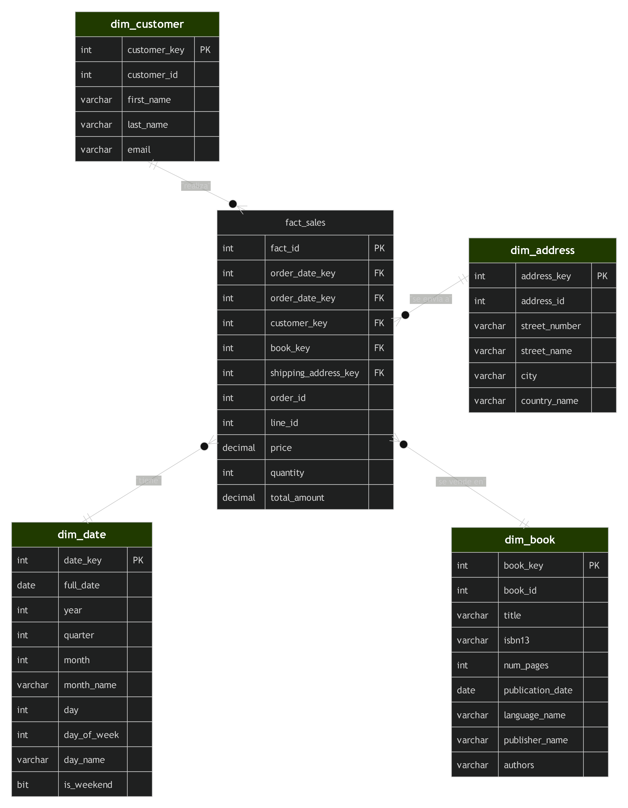

# BookstoreDB-Project
Repositorio académico para la implementación de la base de datos Bookstore.

# 📚 Proyecto Bookstore - Gestión y Analítica de Datos

Este repositorio contiene el diseño, implementación y análisis de la base de datos **Bookstore**, desarrollado como actividad práctica para la Maestría. El proyecto utiliza un enfoque de *Database-as-Code* mediante **SQL Server Database Project** y control de versiones con Git/GitHub.

---

## 👥 Integrantes del Grupo # 4 y Roles

Para maximizar la eficiencia y simular un entorno profesional, distribuimos las actividades entre los 5 integrantes de la siguiente manera:

*   **(Coordinador):** Infraestructura de Git/GitHub, empaquetado del proyecto y documentación final.
*   **(Estructura):** Diseño, normalización y creación de las tablas relacionales.
*   **(Datos):** Generación y carga del script de datos ficticios para pruebas.
*   **(Automatización):** Creación de procedimientos almacenados para operaciones clave.
*   **(Analista):** Consultas analíticas, métricas de negocio y reportes para la toma de decisiones.

---

## 🛠️ Diseño del Data Warehouse

Para simplificar el modelo estrella, he decidido eliminar las dimensiones **`dim_order_status`** y **`dim_shipping_method`**. De esta forma, el modelo se centra en el análisis de ventas por **fecha**, **cliente**, **libro** y **dirección de envío**, que son los ejes principales de negocio. Los estados de pedido y métodos de envío pueden añadirse como atributos en la tabla de hechos si son necesarios, pero no como dimensiones separadas para reducir complejidad.

---

### 1. Descripción del Modelo Simplificado

El modelo consta de una **tabla de hechos** (`fact_sales`) y **cuatro tablas de dimensiones**:

- **`dim_date`** – Fechas de los pedidos (con atributos como año, mes, día, etc.).
- **`dim_customer`** – Datos del cliente (nombre, email).
- **`dim_book`** – Información del libro (título, ISBN, páginas, idioma, editorial y autores concatenados).
- **`dim_address`** – Dirección de envío (calle, ciudad, país).

La tabla de hechos almacena cada línea de pedido con las siguientes medidas:

- `price` (precio unitario)
- `quantity` (cantidad, normalmente 1)
- `total_amount` (price * quantity)
- Además, se conservan claves degeneradas `order_id` y `line_id` para trazabilidad.

---

### 2. Mapeo de Datos desde el Origen (Bookstore) al Data Warehouse

| Tabla destino (DW)        | Origen (Tablas y campos)                                                                                                  |
|---------------------------|---------------------------------------------------------------------------------------------------------------------------|
| **dim_date**              | Se genera a partir de `cust_order.order_date`. Se extraen año, mes, día, trimestre, nombre de mes, día de semana, etc.    |
| **dim_customer**          | `customer.customer_id`, `first_name`, `last_name`, `email`.                                                               |
| **dim_address**           | `address.address_id`, `street_number`, `street_name`, `city`, y `country.country_name` (join con `country`).              |
| **dim_book**              | `book.book_id`, `title`, `isbn13`, `num_pages`, `publication_date`,   `book_language.language_name` (join),   `publisher.publisher_name` (join),   y los nombres de autores concatenados desde `author` a través de `book_author`. |
| **fact_sales**            | - `order_date_key`: clave de `dim_date` a partir de `cust_order.order_date`.   - `customer_key`: de `cust_order.customer_id` → `dim_customer`.   - `book_key`: de `order_line.book_id` → `dim_book`.   - `shipping_address_key`: de `cust_order.dest_address_id` → `dim_address`.   - `order_id`: de `cust_order.order_id`.   - `line_id`: de `order_line.line_id`.   - `price`: de `order_line.price`.   - `quantity`: se asume 1 (no hay campo cantidad en el origen, pero puede fijarse en 1).   - `total_amount`: `price * quantity`. |

**Proceso ETL:**  
Se ejecuta una carga incremental usando los procedimientos `Get...ChangesByRowVersion` ya existentes en el origen, los cuales devuelven los cambios recientes. Para cada pedido, se buscan o crean las claves surrogate en las dimensiones, y se insertan las líneas en `fact_sales`. La dimensión fecha se llena previamente con un rango de fechas.

---

## 📄 Licencia

Este proyecto está bajo la **Licencia MIT**, lo que permite su libre uso, modificación y distribución con fines académicos.
